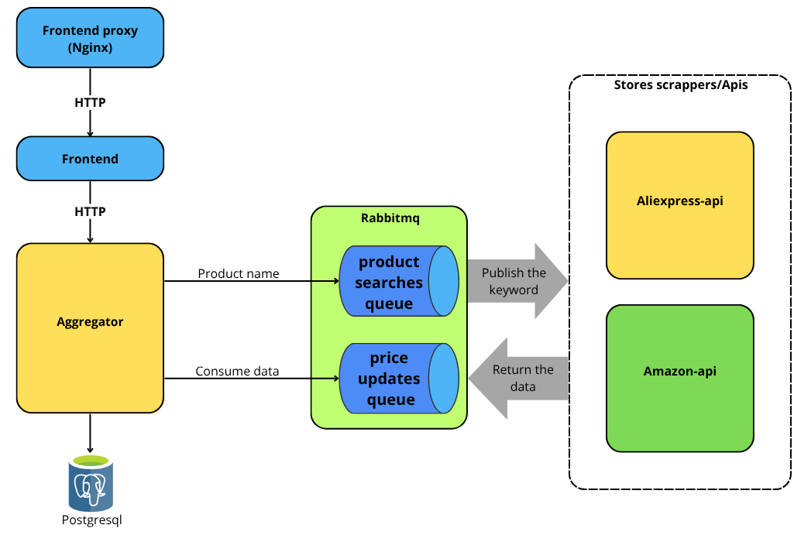

# Price Aggregator App


Real-time product price comparison API aggregating data from Amazon and AliExpress.
## Features

- 🚀 **Real-time price aggregation** from multiple sources
- 🔍 **Product search API** with best-price comparison
- 🐇 **RabbitMQ integration** for scalable data processing
- 🐘 **PostgreSQL storage** with automatic upserts
- 🌐 **CORS-enabled REST API**

## Quick Start

```bash
git clone https://github.com/your-repo/price-aggregator.git
cd price-aggregator
docker compose up -d
```
the code should load the next environment variables:
- AMAZON_API_KEY= 'From rapidapi, a free api exist'
- ALIEXPRESS_API_KEY= 'From rapidapi'
- RABBITMQ_URL= 'Rabbit url'
- DATABASE_URL= 'Postgre url'

## High level Architecture


## Detailed Architecture


## Branching strategy

- master: main dev branch
- features/*: features/services dev branch
- release: production ready branch

 
